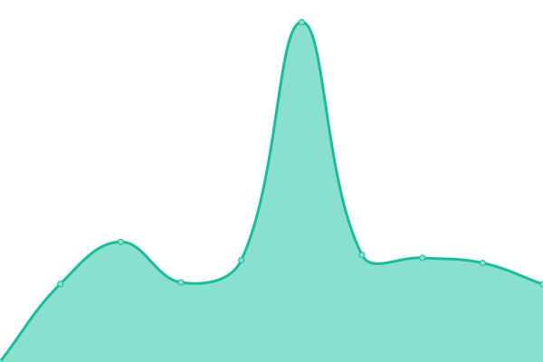
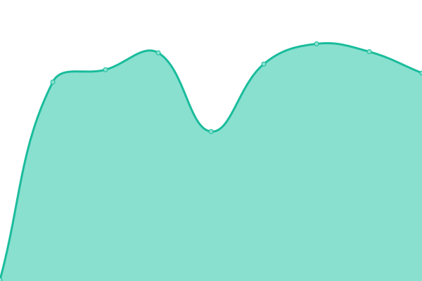

# [📈 Live Status](https://paulosuzano.github.io/upptime): <!--live status--> **🟧 Partial outage**

This repository contains the open-source uptime monitor and status page for [Paulo Suzano](https://paulosuzano.github.io/upptime), powered by [Upptime](https://github.com/upptime/upptime).

With [Upptime](https://upptime.js.org), you can get your own unlimited and free uptime monitor and status page, powered entirely by a GitHub repository. We use [Issues](https://github.com/paulosuzano/upptime/issues) as incident reports, [Actions](https://github.com/paulosuzano/upptime/actions) as uptime monitors, and [Pages](https://paulosuzano.github.io/upptime) for the status page.

<!--start: status pages-->
<!-- This summary is generated by Upptime (https://github.com/upptime/upptime) -->
<!-- Do not edit this manually, your changes will be overwritten -->
<!-- prettier-ignore -->
| URL | Status | History | Response Time | Uptime |
| --- | ------ | ------- | ------------- | ------ |
|  [Site Detran](https://www.detran.ms.gov.br) | 🟩 Up | [site-detran.yml](https://github.com/paulosuzano/upptime/commits/HEAD/history/site-detran.yml) | 

 3042ms
     
 | 

<a href="https://paulosuzano.github.io/upptime/history/site-detran">96.35%</a>
    

|  [WWW2 Valid](https://www2.detran.ms.gov.br/detranet/valid/indexx.asp) | 🟩 Up | [www-2-valid.yml](https://github.com/paulosuzano/upptime/commits/HEAD/history/www-2-valid.yml) | 

 1636ms
     
 | 

<a href="https://paulosuzano.github.io/upptime/history/www-2-valid">96.56%</a>
    

|  [WWW2 Arrecadacao](https://ws-bb.detran.ms.gov.br/ws/ArrecadacaoService?wsdl) | 🟩 Up | [www-2-arrecadacao.yml](https://github.com/paulosuzano/upptime/commits/HEAD/history/www-2-arrecadacao.yml) | 

 2237ms
     
 | 

<a href="https://paulosuzano.github.io/upptime/history/www-2-arrecadacao">96.79%</a>
    

|  [DetranWEB](https://web.detran.ms.gov.br/detran/validartokenacesso?uid=123456) | 🟥 Down | [detran-web.yml](https://github.com/paulosuzano/upptime/commits/HEAD/history/detran-web.yml) | 

 1418ms
     
 | 

<a href="https://paulosuzano.github.io/upptime/history/detran-web">96.63%</a>
    

|  [CONCENTRADOR VPN - OI](189.11.240.74) | 🟥 Down | [concentrador-vpn-oi.yml](https://github.com/paulosuzano/upptime/commits/HEAD/history/concentrador-vpn-oi.yml) | 

 0ms
     
 | 

<a href="https://paulosuzano.github.io/upptime/history/concentrador-vpn-oi">0.00%</a>
    

|  [DEDICADO EMBRATEL](189.86.4.49) | 🟥 Down | [dedicado-embratel.yml](https://github.com/paulosuzano/upptime/commits/HEAD/history/dedicado-embratel.yml) | 

 0ms
     
 | 

<a href="https://paulosuzano.github.io/upptime/history/dedicado-embratel">0.00%</a>
    

|  [DEDICADO OI](200.199.218.129) | 🟩 Up | [dedicado-oi.yml](https://github.com/paulosuzano/upptime/commits/HEAD/history/dedicado-oi.yml) | 

 170ms
     
 | 

<a href="https://paulosuzano.github.io/upptime/history/dedicado-oi">89.44%</a>
    

|  [DNS1 - Detran](ns1.detran.ms.gov.br) | 🟩 Up | [dns-1-detran.yml](https://github.com/paulosuzano/upptime/commits/HEAD/history/dns-1-detran.yml) | 

 182ms
     
 | 

<a href="https://paulosuzano.github.io/upptime/history/dns-1-detran">91.64%</a>
    

|  [DNS2 - Detran](ns2.detran.ms.gov.br) | 🟩 Up | [dns-2-detran.yml](https://github.com/paulosuzano/upptime/commits/HEAD/history/dns-2-detran.yml) | 

 183ms
     
 | 

<a href="https://paulosuzano.github.io/upptime/history/dns-2-detran">97.14%</a>
    

|  [VPN Embratel](200.183.148.194) | 🟥 Down | [vpn-embratel.yml](https://github.com/paulosuzano/upptime/commits/HEAD/history/vpn-embratel.yml) | 

 0ms
     
 | 

<a href="https://paulosuzano.github.io/upptime/history/vpn-embratel">0.00%</a>
    

|  [VPN Oi](200.199.218.188) | 🟥 Down | [vpn-oi.yml](https://github.com/paulosuzano/upptime/commits/HEAD/history/vpn-oi.yml) | 

 0ms
     
 | 

<a href="https://paulosuzano.github.io/upptime/history/vpn-oi">0.00%</a>
    

<!--end: status pages-->

[**Visit our status website →**](https://paulosuzano.github.io/upptime)

## 📄 License

- Powered by: [Upptime](https://github.com/upptime/upptime)
- Code: [MIT](./LICENSE) © [Anand Chowdhary](https://anandchowdhary.com), supported by [Pabio](https://pabio.com)
- Data in the `./history` directory: [Open Database License](https://opendatacommons.org/licenses/odbl/1-0/)
